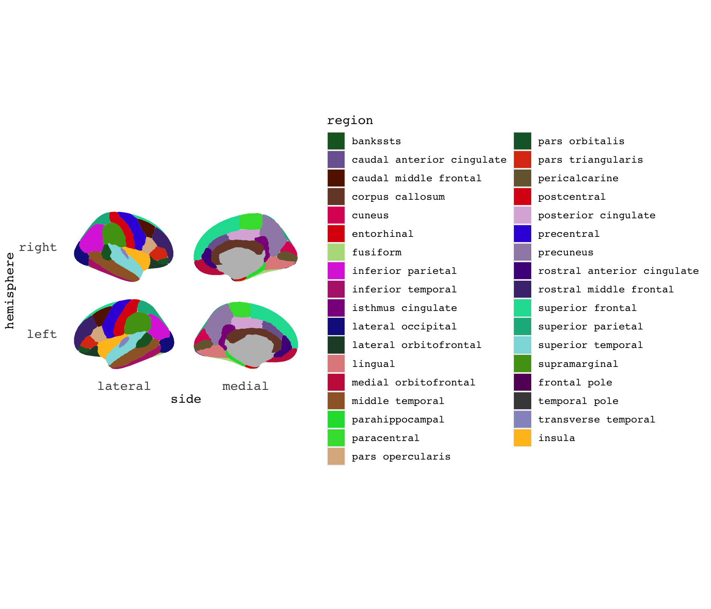
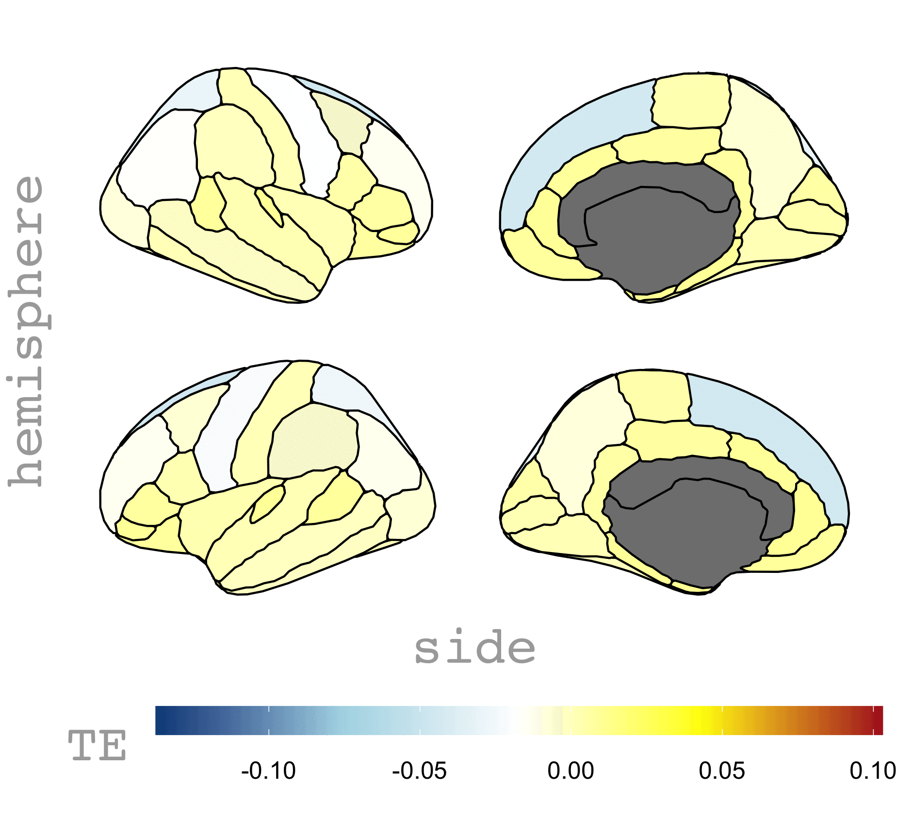

# Objectives

To view the flow of information between the brain regions of a normal healthy subjects. We achieve it via visualizing the flow on the Desikan-Killnary atlas (shown in Fig1.) in the R ggseg library.

### **Figure 1. Regions of the DK atlas considered in this project**

## Background

Brain in a normal relaxed state is believed to form a network widely known as default-mode network, which is also caleed task-negative network as it is deactivated during brain tasks such as motion. While the existence of default mode network is well-studied  in the neuroscience literature, the direction of information flow among the network is largely unknown or still in debate. The reason is that there is no existing opinion still among the neuroscience community regarding the mathematical measure of information flow and the actual proven neural ground truth about the direction of information transfer. In this project, we try to deduce the information flow using the standard transfer entropy approach.

We use the resting-state fMRI data from Human connectome project (http://www.humanconnectomeproject.org/) where the data are  already pre-processed. We mapped the time series to DK atlas  and obtained the 68 region specific time series. We then find the transfer entropy of all these regions. The data.csv file summarized the transfer entropy values. We focus on the whole brain network rather than the default mode alone.

## Transfer entropy
Transfer entropy is a statistical concept which is related to the causality of two time series namely it identifies the source and target. This concept could be used for the brain signals from the resting state fMRI or EEG. There are other measures such as the Phase transfer entropy but we focus only on the transfer entropy here.

### **Figure 2. A possible flow of information  captured in the network**

## Results and Discussions 
As we see from Fig. 2 that the brain signals move from the source regions around posterior cingulate cortex, anterior cingulate cortex towards the target regions such as the lingual and lateral occipital lobes. This observation makes sense as it may follow the well known predicted (yet largely not confirmed) directional theory of the default mode network.
 
